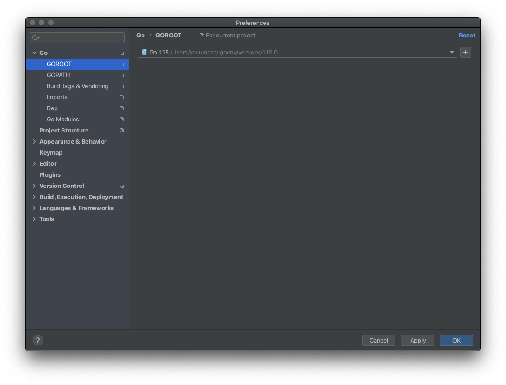
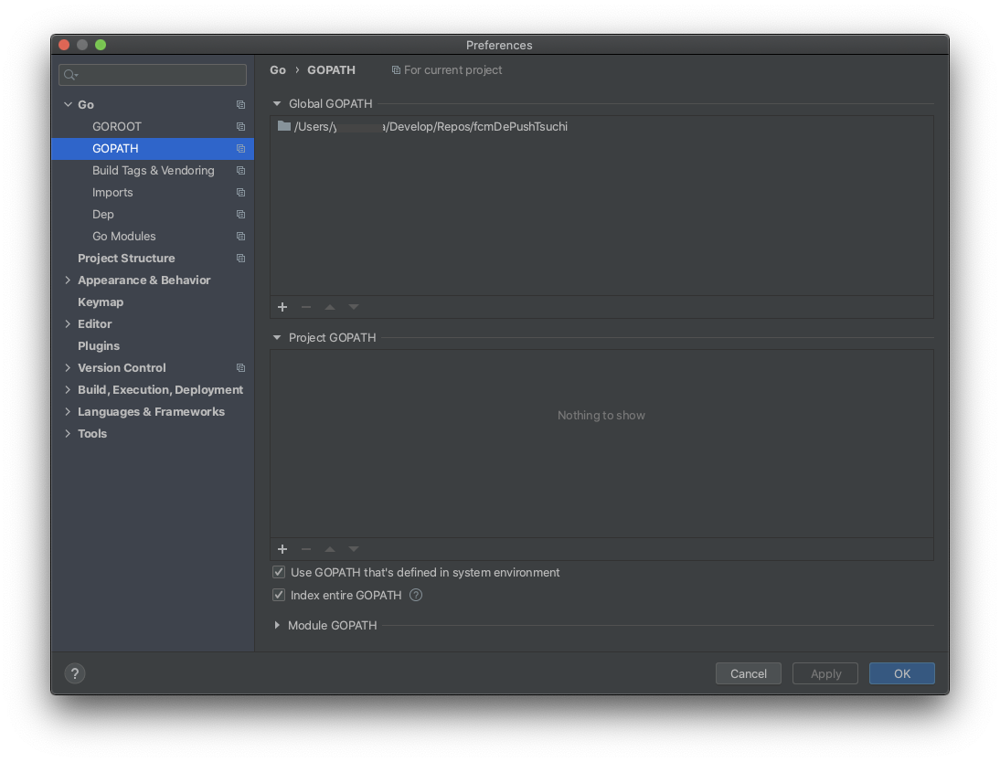
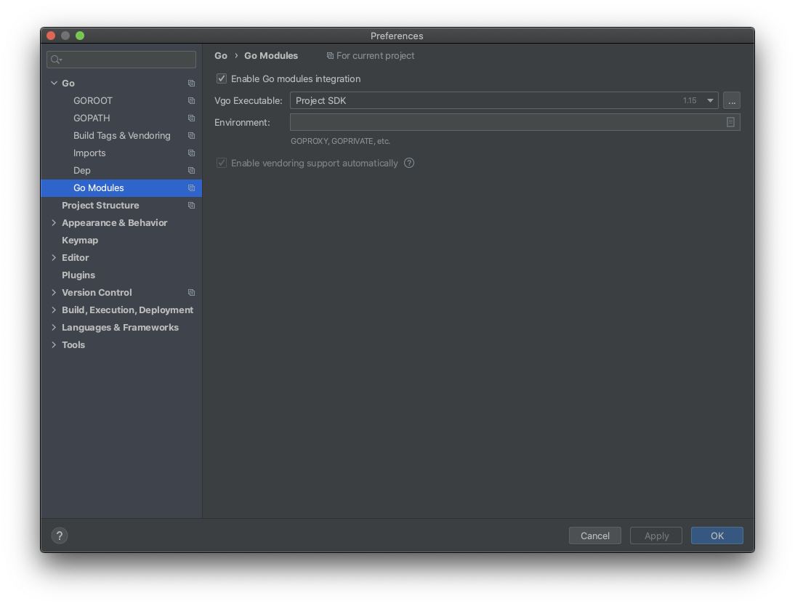
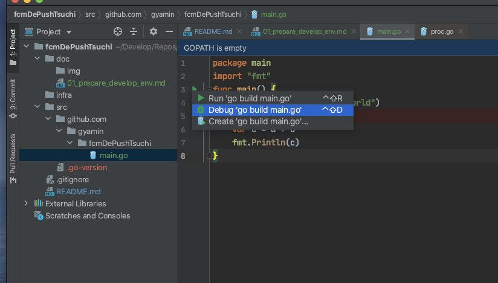

# 環境構築

## 初期構築

#### ディレクトリ作成
```
$ mkdir -p src/github.com/gyamin/fcmDePushTsuchi
```

#### goのインストール(goenv利用)
```
$ cd src
$ goenv local 1.15.0
$ go version
go version go1.15 darwin/amd64
```

#### ディレクトリ構成とModules
プロジェクトのルートで`go mod init`を実行すると、直下にgo.modファイルが作成される。
```
$ cd ./src/github.com/gyamin/fcmDePushTsuchi
$ go mod init github.com/gyamin/fcmDePushTsuchi
go: creating new go.mod: module github.com/gyamin/fcmDePushTsuchi
$ ls -l
-rw-r--r--  1 yasumasa  staff  50  9 13 16:16 go.mod
```

goの標準ディレクトリ構成にしたがって、cmdディレクトリを作成して、mainパッケージを作成する。
```
$ mkdir cmd
$ cd cmd
$ touch test.go
```
test.go
``` go
package main

import (
	"fmt"
	"rsc.io/quote"
)

func main() {
	fmt.Println(quote.Hello())
```

#### ビルド
```
$ go build -o test
go: finding module for package rsc.io/quote
go: found rsc.io/quote in rsc.io/quote v1.5.2
```
ビルドすると、依存関係にあるパッケージを自動でダウンロードしてくれる

go.modファイルに依存関係が記述される
```
$ cat ../go.mod 
module github.com/gyamin/fcmDePushTsuchi

go 1.15

require rsc.io/quote v1.5.2
```
go.sumファイルも作成される
```
$ cat ../go.sum 
golang.org/x/text v0.0.0-20170915032832-14c0d48ead0c h1:qgOY6WgZOaTkIIMiVjBQcw93ERBE4m30iBm00nkL0i8=
golang.org/x/text v0.0.0-20170915032832-14c0d48ead0c/go.mod h1:NqM8EUOU14njkJ3fqMW+pc6Ldnwhi/IjpwHt7yyuwOQ=
rsc.io/quote v1.5.2 h1:w5fcysjrx7yqtD/aO+QwRjYZOKnaM9Uh2b40tElTs3Y=
rsc.io/quote v1.5.2/go.mod h1:LzX7hefJvL54yjefDEDHNONDjII0t9xZLPXsUe+TKr0=
rsc.io/sampler v1.3.0 h1:7uVkIFmeBqHfdjD+gZwtXXI+RODJ2Wc4O7MPEh/QiW4=
rsc.io/sampler v1.3.0/go.mod h1:T1hPZKmBbMNahiBKFy5HrXp6adAjACjK9JXDnKaTXpA=
```

ダウンロードされたパッケージは、以下のようにMacの場合$HOME/goディレクトリに作成される
```
$ ls ~/go/1.15.0/pkg/mod/
cache      golang.org rsc.io
```

GOPATHを指定した場合は、$GOPATH/pkgにパッケージがダウンロードされる
```
$ export GOPATH=/Users/{userName}/Develop/Repos/fcmDePushTsuchi
$ ls $GOPATH/pkg
mod
```

## 開発環境

### GoLandセットアップ

#### GOROOT、GOPATH、Go Modules指定
[cmd + ,]でpreferenceを表示

GOROOTにgoenvでインストールし、今回のプロジェクトで利用するgoを追加する。
goenvでは~/.goenv/versions/1.15.0/という形でgoが配置されている。GOROOTの指定も.goenv/versions/1.15.0/までを指定する。


GOPATHの指定は必須ではないと思うが、これまでの慣例にしたがって、プロジェクトディレクトリを指定する。


パッケージ管理にGo Modulesを利用するのでGoLandでも有効にする


#### デバッグの実行
ソースにブレークポイントを設定し、Debugを実行する。
