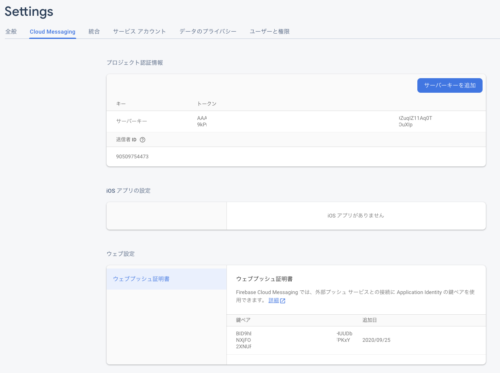

# WebPushが届くまで

## 概要
Firebaseを利用してWebPushを実現する。

## プロジェクトの準備

## Webプログラム

### html
WebPushであるので、Push受信画面の実装が必要になる。
実装は大きく以下の通り。
- Firebase からトークンを取得する  [サンプルhtml](./../web/public/push_test.html)
    ```
    messaging.usePublicVapidKey('BID9hBILxxxxx');
    ```
    
    ウェブプッシュ証明書の鍵ペアの値を指定する
    
- Firebase からトークンを取得する  [サンプルhtml](./../web/public/push_test.html)      
　ここはサンプルの通り。これでトークンを取得している。本来であれば、取得したトークンをサーバに送信して、送信されたトークンを利用してPUSHを送信する。
    ```js
            // [START get_token]
            // Get Instance ID token. Initially this makes a network call, once retrieved
            // subsequent calls to getToken will return from cache.
            messaging.getToken().then((currentToken) => {
                if (currentToken) {
                    sendTokenToServer(currentToken);
                    updateUIForPushEnabled(currentToken);
                } else {
                    // Show permission request.
                    console.log('No Instance ID token available. Request permission to generate one.');
                    // Show permission UI.
                    updateUIForPushPermissionRequired();
                    setTokenSentToServer(false);
                }
            }).catch((err) => {
                console.log('An error occurred while retrieving token. ', err);
                showToken('Error retrieving Instance ID token. ', err);
                setTokenSentToServer(false);
            });
            // [END get_token]
    ```
### firebase-messaging-sw.js
メッセージの受信には、firebase-messaging-sw.js ファイルを作成してpublicディレクトリに配置する必要がある。
- https://firebase.google.com/docs/cloud-messaging/js/first-message?hl=ja
- https://firebase.google.com/docs/cloud-messaging/js/receive?hl=ja

## Push送信
Goを利用してPUSH送信する。
Web画面で表示したトークンを指定して、PUSHを送信するサンプル。
```Go
	registrationToken := "cS62HS9xxxxxxxxxxxxOL-Im"
```
[サンプルプログラム](./../src/github.com/gyamin/fcmDePushTsuchi/cmd/main.go)

プログラム起動時に、
GOOGLE_APPLICATION_CREDENTIALS 環境変数 を指定する。      
サービス アカウント作成時にダウンロードしたJSONファイルのパスを指定する。

```
export GOOGLE_APPLICATION_CREDENTIALS=/Users/xxxx/fcm-de-push-firebase-adminsdkxxxxxxx.json
```

上記でGoを実行すると、めでたくPUSHが届く。