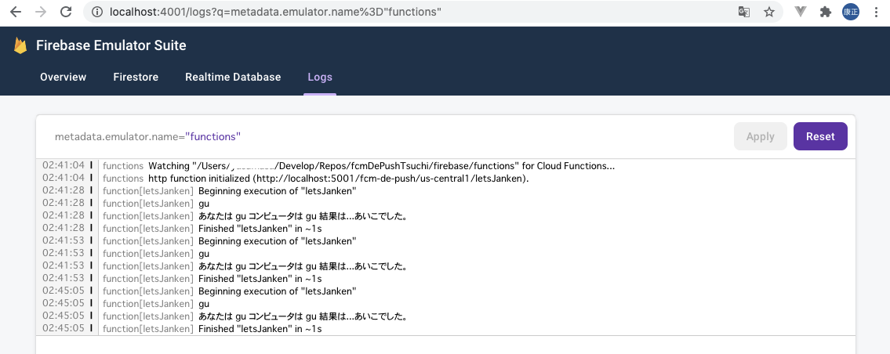
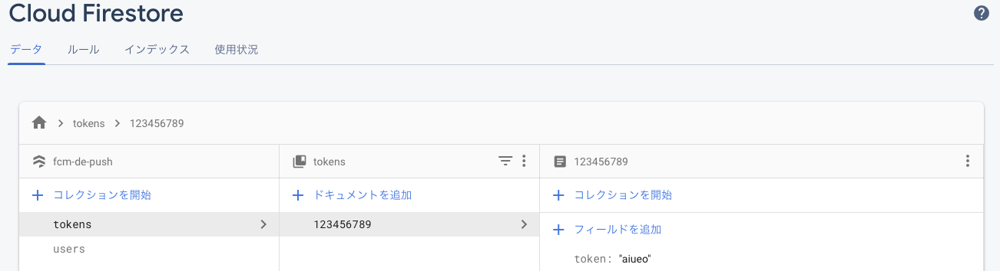

# Functionsの利用

## 概要
FirebaseのFunctions機能を利用してみる。

## サンプル

[参考](https://firebase.google.com/docs/functions/get-started?hl=ja)

初期化
```
$ firebase init functions
...
? What language would you like to use to write Cloud Functions? JavaScript
? Do you want to use ESLint to catch probable bugs and enforce style? Yes
✔  Wrote functions/package.json
✔  Wrote functions/.eslintrc.json
✔  Wrote functions/index.js
✔  Wrote functions/.gitignore
? Do you want to install dependencies with npm now? Yes
...
✔  Firebase initialization complete!
```

初期化するとfunctionsフォルダが作成される。その中のファイルに処理記載すればいい。
[実装例](./../firebase/functions/index.js)

### ローカルで実行する方法
emulator を実行すると、ローカルで動作確認できる。
```
$ firebase emulators:start
...
│ Emulator  │ Host:Port      │ View in Emulator UI             │
├───────────┼────────────────┼─────────────────────────────────┤
│ Functions │ localhost:5001 │ http://localhost:4001/functions │
├───────────┼────────────────┼─────────────────────────────────┤
│ Hosting   │ localhost:5000 │ n/a                             │
└───────────┴────────────────┴─────
```

:5001ポートでFunctionsが提供される。
```
$ curl http://localhost:5001/fcm-de-push/us-central1/letsJanken?hand=gu
{"result":"あなたは gu コンピュータは gu 結果は...あいこでした。"}
```

:4001ポートにアクセスすると、コンソールを確認できる。（ターミナルにも表示されるけど。）


## FunctionsからFirestoreにデータ保存する

[サーバーに Firebase Admin SDK を追加する](https://firebase.google.com/docs/admin/setup?authuser=0)

Functionsで何らかの処理をして、結果をFirestoreに保存することを実現したい。
どうも Firebase Admin SDK を利用することで実現するらしい。

インストール
```
$ pwd
/fcmDePushTsuchi/firebase
$ npm init
$ npm install firebase-admin --save
```

### 使用例

Functionsで実行する場合
[例](./../firebase/functions/index.js)
```javascript
const admin = require('firebase-admin')
admin.initializeApp(functions.config().firebase)

exports.testFirestore = functions.https.onRequest(async (req, res) => {
    const query = req.query;

    let fireStore = admin.firestore()
    let fsTokens = fireStore.collection('tokens');
    fsTokens.doc('123456789').set({
        token: query.token
    })
    res.json({result: 'OK'});
});
```

上記を実行すると、Firestoreにデータが保持される。
